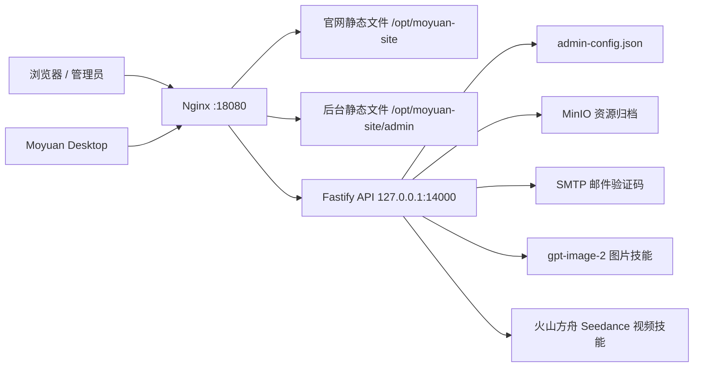

# 墨渊后台部署说明

这份文档给后续协同的 AI 或开发者使用。目标是说明后台怎么跑、怎么部署、配置放在哪里、哪些地方不能乱动。

## 当前部署形态



- 官网访问：`http://codex.tminos.com:18080/`
- 后台访问：`http://codex.tminos.com:18080/admin/`
- 后台 API 反代：`http://codex.tminos.com:18080/admin-api/`
- 健康检查：`http://codex.tminos.com:18080/admin-health`
- 服务器入口：`ssh jia.zhuzhux.com`
- 服务器只对外使用 `18080` 作为网站入口。

## 代码目录

- `apps/admin`：Ant Design Pro / Umi Max 后台前端。
- `services/api`：Fastify 后台 API，负责账号、验证码、模型配置、技能密钥、额度、资源记录。
- `packages/shared`：前后端共享类型，改接口结构时优先改这里。
- `apps/site/deploy/nginx-codex.tminos.com.conf`：当前官网 + 后台的 Nginx 配置参考。
- `services/api/deploy/moyuan-api.service`：systemd 服务参考。

## 运行端口

- `apps/admin` 开发端口由 Umi Max 分配，开发时走 `npm run dev:admin`。
- `services/api` 默认监听 `0.0.0.0:4000`。
- 服务器生产环境建议监听 `127.0.0.1:14000`，由 Nginx 反代到 `/admin-api/`。
- Nginx 对外监听 `18080`。

## 关键环境变量

生产环境建议放在 `/opt/moyuan-api/.env`，不要提交到 Git。

```bash
NODE_ENV=production
API_HOST=127.0.0.1
API_PORT=14000
ADMIN_CONFIG_FILE=/opt/moyuan-api/data/admin-config.json

# 管理员首次初始化可通过后台页面完成。
# 如需用环境变量预置，设置后首次启动会生成管理员账号。
ADMIN_USERNAME=admin
ADMIN_PASSWORD=change-me

# 默认模型通道，只作为初始值；后台保存后以 admin-config.json 为准。
AI_BASE_URL=https://your-openai-compatible-gateway/v1
AI_API_KEY=replace-with-secret
AI_MODEL=gpt-5-codex

# 图片技能，只作为初始值；后台保存后以 admin-config.json 为准。
IMAGE_BASE_URL=https://your-image-gateway/v1
IMAGE_API_KEY=replace-with-secret
IMAGE_MODEL=gpt-image-2

# 火山方舟视频技能，只作为初始值；后台保存后以 admin-config.json 为准。
VOLCENGINE_ARK_BASE_URL=https://ark.cn-beijing.volces.com/api/v3
VOLCENGINE_ARK_API_KEY=replace-with-secret
VOLCENGINE_VIDEO_MODEL=doubao-seedance-2-0-260128

# QQ 邮箱 / SMTP 验证码服务。
MAIL_SMTP_HOST=smtp.qq.com
MAIL_SMTP_PORT=465
MAIL_USERNAME=your@qq.com
MAIL_FROM_NAME=墨渊
QQ_MAIL_AUTH_CODE=replace-with-secret

# MinIO 资源归档。未配置时不会归档到 MinIO，但接口仍可返回上游资源。
MINIO_ENDPOINT=http://jia.zhuzhux.com:10900
MINIO_BUCKET=worldcup-materials
MINIO_PUBLIC_BASE_URL=http://jia.zhuzhux.com:10900/worldcup-materials
MINIO_ACCESS_KEY=replace-with-secret
MINIO_SECRET_KEY=replace-with-secret
MINIO_REGION=us-east-1
```

注意：后台页面保存后的密钥、用户、额度、资源记录都在 `ADMIN_CONFIG_FILE` 指向的 JSON 文件里。后续 AI 修改部署时，不能覆盖这个文件。

## 本地开发

在仓库根目录执行：

```bash
npm install
npm run dev:api
npm run dev:admin
```

本地检查：

```bash
npm run typecheck -w @eaw/api
npm run typecheck -w @eaw/admin
npm run build -w @eaw/api
npm run build -w @eaw/admin
```

后台前端默认请求 `/admin-api`。本地如果没有 Nginx，需要用开发代理或直接打开对应 API 地址调试。

## 服务器部署步骤

以下命令是说明性质，执行前先确认用户明确要求部署。用户已强调：未明确要求时不要发布、不要部署、不要推送。

1. 进入服务器：

```bash
ssh jia.zhuzhux.com
```

2. 创建目录：

```bash
sudo mkdir -p /opt/moyuan-api/data
sudo mkdir -p /opt/moyuan-site/admin
```

3. 部署 API 代码：

推荐先在本地构建，再把必要文件同步到 `/opt/moyuan-api`。如果在服务器直接构建，也要保证 Node.js 版本支持当前项目。

```bash
npm install
npm run build -w @eaw/api
```

API 运行需要：

- `services/api/dist`
- `services/api/package.json`
- 根目录 `package-lock.json`
- `packages/shared`
- 根目录 `node_modules` 或在服务器重新安装依赖
- `/opt/moyuan-api/.env`
- `/opt/moyuan-api/data/admin-config.json`

4. 配置 systemd：

参考文件：`services/api/deploy/moyuan-api.service`

服务关键点：

- `WorkingDirectory=/opt/moyuan-api`
- `EnvironmentFile=-/opt/moyuan-api/.env`
- `ExecStart=/usr/bin/node dist/index.js`
- `Restart=always`

常用操作：

```bash
sudo systemctl daemon-reload
sudo systemctl enable moyuan-api
sudo systemctl restart moyuan-api
sudo systemctl status moyuan-api --no-pager
journalctl -u moyuan-api -n 200 --no-pager
```

5. 构建并部署后台静态文件：

```bash
npm run build -w @eaw/admin
```

把 `apps/admin/dist/` 同步到：

```bash
/opt/moyuan-site/admin/
```

6. 配置 Nginx：

参考文件：`apps/site/deploy/nginx-codex.tminos.com.conf`

关键规则：

- `/admin/` 使用 `alias /opt/moyuan-site/admin/`
- `/admin-api/` 反代到 `http://127.0.0.1:14000/api/admin/`
- `/admin-health` 反代到 `http://127.0.0.1:14000/health`

检查并重载：

```bash
sudo nginx -t
sudo systemctl reload nginx
```

## 后台数据与备份

当前后台第一版使用 JSON 文件持久化：

```bash
/opt/moyuan-api/data/admin-config.json
```

里面包含：

- 管理员账号哈希和会话。
- 模型通道和密钥。
- 图片、视频技能配置和密钥。
- SMTP 配置和授权码。
- 用户账号、登录会话、Token 额度和用量。
- 图片、视频资源记录。
- 视频任务扣费记录，避免重复扣费。

每次部署 API 前必须备份：

```bash
cp /opt/moyuan-api/data/admin-config.json /opt/moyuan-api/data/admin-config.$(date +%Y%m%d-%H%M%S).json
```

如果后台报错或数据结构升级失败，先恢复备份，再看 `services/api/src/index.ts` 里的 `StoredAdminConfig`、`needsStoredConfigMigration`、`persistStoredConfig`。

## 技能与计费逻辑

后台当前有三类能力：

- 模型通道：`/api/admin/model-provider`，给桌面端和 Runtime 下发模型地址、模型名和可用状态。
- 图片技能：`/api/admin/skills/image/generations`，要求上游返回 `usage.total_tokens`，否则拒绝计费。
- 视频技能：`/api/admin/skills/video/generations` 和 `/api/admin/skills/video/generations/:taskId`，Seedance 任务成功后读取查询接口里的 `usage.total_tokens` 扣费。
- 客户端日志：桌面端登录后会 POST 到 `/api/admin/client-logs`，后台“日志管理”页面通过 GET `/api/admin/client-logs` 查看用户、设备、系统、IP、事件、任务和错误详情。

资源记录在：

```http
GET /api/admin/generated-assets
```

用户和额度在：

```http
GET /api/admin/users
PUT /api/admin/users/:id/quota
```

普通对话用量目前由客户端或 Runtime 上报：

```http
POST /api/admin/me/usage
```

后续更可靠的方案是把模型中转封装进后台或独立 gateway，这样普通对话的 usage 可以从服务端统一记录，不依赖客户端估算。

## 验收清单

部署后按顺序检查：

```bash
curl -i http://127.0.0.1:14000/health
curl -i http://codex.tminos.com:18080/admin-health
```

浏览器检查：

- `http://codex.tminos.com:18080/` 能打开官网。
- `http://codex.tminos.com:18080/admin/` 能打开后台。
- 后台刷新页面不会 404。
- 管理员能初始化或登录。
- 模型配置保存后刷新仍存在。
- SMTP 测试邮件能发送。
- 图片技能保存后能生成图片，并产生资源记录和 Token 用量。
- 视频技能保存后能创建任务，任务成功后能扣除 `usage.total_tokens`。
- 用户注册登录后，后台能看到用户和额度。

## 常见问题

后台白屏：

- 先看浏览器控制台。
- 确认 `/admin/` 指向的是 `apps/admin/dist`。
- 确认 Umi 配置仍是 `base: '/admin/'`、`publicPath: '/admin/'`。

接口 404：

- 检查 Nginx `/admin-api/` 是否反代到 `http://127.0.0.1:14000/api/admin/`。
- 注意路径结尾斜杠，`proxy_pass` 当前依赖 `/api/admin/`。

接口 401：

- 后台管理员已初始化时，需要登录管理员。
- 桌面端用户接口需要用户 token。

配置保存后丢失：

- 检查 `ADMIN_CONFIG_FILE` 是否固定到 `/opt/moyuan-api/data/admin-config.json`。
- 检查服务进程是否有写入该目录权限。

技能生成成功但后台没有资源：

- 图片接口必须返回 `usage.total_tokens`。
- 视频查询接口成功后必须返回 `usage.total_tokens`。
- MinIO 未配置时可能没有 `storageUrl`，但仍应有资源记录。

## 桌面端自动更新

墨渊桌面端使用 Electron 标准自动更新链路：

- 更新源：`http://codex.tminos.com:18080/downloads/`
- Windows 元数据：`latest.yml`
- macOS 元数据：`latest-mac.yml`
- Windows 安装包：`Moyuan-Desktop-x.x.x-win-x64.exe`
- macOS 更新包：`Moyuan-Desktop-x.x.x-mac-arm64.zip`
- 官网展示下载包：`Moyuan-Desktop-x.x.x-mac-arm64.dmg` 和 Windows exe

发布新版本时，除了官网展示的 dmg/exe，也必须把以下文件同步到 `/opt/moyuan-site/downloads/`：

- `latest.yml`
- `latest-mac.yml`
- `*.blockmap`
- `Moyuan-Desktop-*-mac-arm64.zip`
- `Moyuan-Desktop-*-win-x64.exe`

客户端启动后会自动检查更新。有新版本时提示下载，下载完成后提示用户重启安装。不要让用户每次重新访问官网手动下载安装。

## 给其他 AI 的协作规则

1. 先读本文件、`docs/MOYUAN_ARCHITECTURE.md`、`services/api/src/index.ts`、`apps/admin/src/services/admin.ts`。
2. 不要把密钥写进代码、文档、README 或提交记录。
3. 不要覆盖 `/opt/moyuan-api/data/admin-config.json`；改数据结构前先备份。
4. 没有用户明确要求时，不要发布 GitHub Release，不要部署官网，不要重启线上服务。
5. 新增后台字段时，同步修改 `packages/shared/src/index.ts`、`services/api/src/index.ts`、`apps/admin/src/services/admin.ts` 和对应页面。
6. 新增技能时遵循四段结构：后台配置、技能说明、工具契约、执行器。
7. 修改后台 UI 时优先拆页面和服务文件，不要把所有逻辑堆进单个大文件。
8. 改完至少跑对应 workspace 的 typecheck 和 build。
